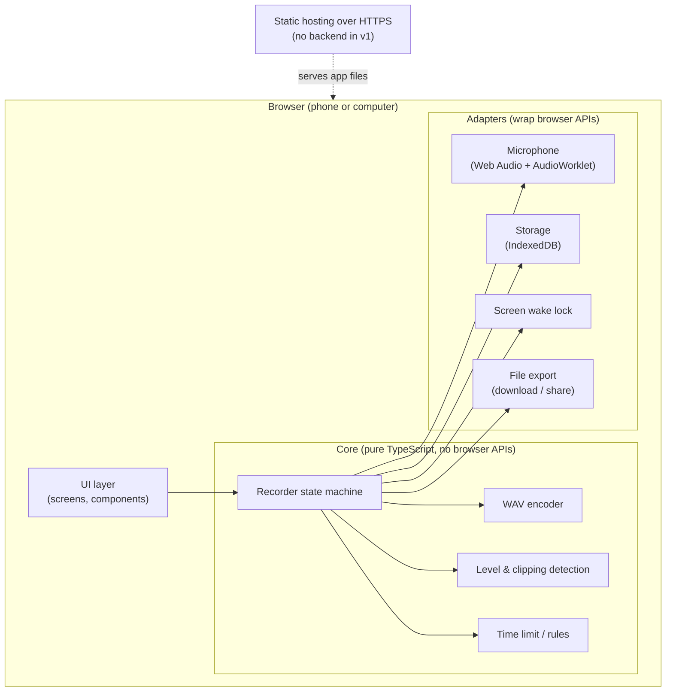

# 05 — Architecture & Decisions

_Status: **Agreed v1.0** (2026-10-06)._

## Overview

**Idea in one sentence:** all logic that can be tested without a browser lives in **Core**; everything that talks
to the browser or device is a thin **Adapter** with an interface that tests can replace with a fake.

## How the architecture maps to test levels

| Layer | What is tested | Tool | Speed | Share of tests |
|-------|----------------|------|-------|----------------|
| Core | Rules, state transitions, WAV bytes, clipping detection | Vitest (unit) | ms | Most |
| Core + fake adapters | Whole flows (record → interrupt → recover) without a browser | Vitest (integration) | ms | Many |
| Adapters | Real browser APIs behave as we assume | Vitest browser mode / Playwright | s | Few |
| Whole app | Feature files (`/features`) in a real browser with fake microphone | playwright-bdd (acceptance) | s | Every scenario |
| Real devices | Assumptions about the phone, sound quality | Exploratory charters | min | Per P5 |

Extra quality signals: **mutation testing** (Stryker) on Core, **accessibility scan** (axe) in acceptance tests,
TypeScript strict mode + ESLint as static checks.

---

## ADR-001: BDD runner = playwright-bdd (TypeScript) — ✅ agreed
- **Date:** 2026-10-01
- **Context:** Acceptance criteria live in `/features/*.feature` and must run as tests.
  Options were Reqnroll + Playwright for .NET (C#) or playwright-bdd (TypeScript).
- **Decision:** playwright-bdd. The app and all tests use TypeScript.
- **Consequences:** One language and one toolchain (Node). Step definitions are TypeScript functions.

| Reqnroll (C#) | playwright-bdd (TS) |
|---------------|---------------------|
| `[Binding]` class with `[Given("...")]` methods | `Given('...', async ({ page }) => { ... })` |
| Cucumber expressions / regex in attributes | Cucumber expressions in strings |
| `ScenarioContext` / context injection | Playwright **fixtures** |
| `[BeforeScenario]` / `[AfterScenario]` hooks | `Before` / `After` hooks, or fixtures |
| `@tag` filtering in the test runner | `npx bddgen && npx playwright test --grep @r0.1` |

## ADR-002: Client-only web app (PWA), no backend in v1 — ✅ agreed 2026-10-06
- **Context:** No sync in v1 (manual file transfer), audio must stay on the device (NFR-SEC-001), no analytics.
- **Decision:** The app runs completely in the browser and is served as static files over HTTPS.
- **Consequences:** No server, database or login to build, host or test. A backend can be added later (cloud inbox, Option B).
  Installable as a PWA (home-screen icon on the phone) to support fast start (NFR-PERF-001).

## ADR-003: TypeScript + Vite + React — ✅ agreed 2026-10-05
- **Context:** One language for app and tests (ADR-001). Fast start on the phone (≤ 3 s, stretch 1.5 s).
- **Decision:** TypeScript (strict) and Vite as build tool. UI framework: see options.

| Option | For | Against |
|--------|-----|---------|
| **React** | Most used; most test tooling and job-market relevance (React Testing Library) | Larger bundle |
| **Svelte** | Small and fast; simple code | Smaller ecosystem |
| **Preact** | React API with a tiny bundle | Some React libraries need adapting |

- **Decision:** React. The UI is small, so bundle size is not a real problem, and the testing skills (React Testing Library) transfer to most jobs.

## ADR-004: Capture raw audio with Web Audio API + AudioWorklet (not MediaRecorder) — ✅ agreed 2026-10-05
- **Context:** Browsers offer two ways to record:
  - `MediaRecorder` is simple, but gives **compressed** audio (Opus/WebM) and imprecise timing.
  - **Web Audio API with an AudioWorklet** gives the **raw samples** as they arrive.
- **Decision:** AudioWorklet, raw samples.
- **Consequences:**
  - Lossless audio, so a true 24-bit WAV is possible (EXP-001, R5).
  - Level meter and clipping detection work on the same samples (REC-005, R11).
  - Audio can be saved in small chunks while recording (REC-003, ≤ 2 s loss).
  - Exact sample positions, needed for track alignment in 0.2 (R1).
  - More code than MediaRecorder; the WAV encoder must be written and tested (Core, unit tests).

## ADR-005: Storage = IndexedDB, saved in chunks of ~1 s — ✅ agreed 2026-10-06
- **Context:** Recordings must survive reload/close/crash (STO-001, REC-003) with ≤ 2 s loss.
- **Decision:** Store audio in IndexedDB in chunks of about 1 second while recording. Ask the browser for persistent
  storage (`navigator.storage.persist()`, R12).
- **Consequences:** Worst case after a crash is about 1 s lost, within the 2 s limit. Recovery on start-up must
  rebuild a recording from its chunks (tested with crash simulation, R3/R4).

## ADR-006: Ports & adapters for testability — ✅ agreed 2026-10-06
- **Context:** Many risks (R3, R4, R9, R11, R12) depend on browser/device events that tests must be able to trigger.
- **Decision:** Core logic never calls browser APIs directly. It talks to interfaces ("ports"):
  `AudioInput`, `RecordingStore`, `WakeLock`, `FileExporter`, `Clock`. Real implementations ("adapters") wrap the browser;
  tests use fakes.
- **Consequences:** Most behaviour can be tested in milliseconds without a browser. A fake `Clock` makes the
  5-minute limit testable without waiting 5 minutes.

## ADR-007: Recorder as an explicit state machine — ✅ agreed 2026-10-06
- **Context:** Recording has many states and events (idle, asking permission, recording, interrupted, full storage, ...).
  Bugs hide in unexpected transitions.
- **Decision:** Model the recorder as an explicit state machine with a table of allowed transitions.
- **Consequences:** Enables **state transition testing**: every state × event combination can be tested, including
  invalid ones (e.g. "stop" while idle). The state diagram doubles as documentation.

## ADR-008: Hosting = GitHub Pages, public repository — ✅ agreed 2026-10-06 (repo made public)
- **Context:** Everything should be in one place. GitHub Pages is free for **public** repositories
  (private ones need a paid plan). Microphone access requires HTTPS (NFR-SEC-002), which GitHub Pages provides.
- **Decision:** Make the repository public and deploy with GitHub Actions to GitHub Pages.
- **Consequences:**
  - One place for code, docs, CI and hosting.
  - **Trade-off:** GitHub Pages hosts one site, so there is no automatic preview URL per pull request
    (Cloudflare Pages / Netlify would give that). Changes are tested locally and in CI before merge,
    and on the reference phone after deploy. Revisit if this becomes a problem.
  - Security measures for a public repository: see below.

### Security measures for a public repository
| Risk | Measure |
|------|---------|
| Secrets (keys, passwords) committed by mistake | The app needs no secrets (no backend). Enable GitHub **secret scanning + push protection** (free for public repos). |
| Personal e-mail visible in commit history | Use GitHub's `noreply` commit e-mail for future commits. |
| Malicious pull requests from forks running in CI | Default GitHub settings: fork PRs run without secrets and need approval. Never use `pull_request_target`. Workflows get minimal `permissions`. |
| Vulnerable npm dependencies (supply chain) | Lockfile committed; **Dependabot** alerts and updates; `npm audit` in CI. |
| Others copy the code | Allowed to read; reuse only under the licence we choose (no licence = all rights reserved). |
| Users' data | Not affected by repo visibility: audio stays on the user's device (NFR-SEC-001). The deployed site is public either way. |
