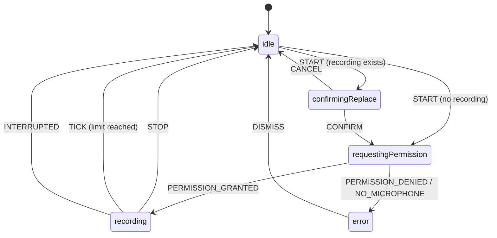

# Recorder state machine (ADR-007)

_Status: **Agreed** (2026-10-06). Implemented in `src/core/recorder/`._

The recorder is a pure function `transition(state, event) → state` with an explicit table of allowed transitions.
It knows nothing about the browser: adapters (microphone, clock, storage) send it events, and the UI shows its state.

## States
| State | Meaning | Shown to the user |
|-------|---------|-------------------|
| `idle` | Microphone closed. A finished recording may exist. | Start is possible |
| `requestingPermission` | Waiting for the user to answer the browser's microphone prompt | Waiting for access |
| `confirmingReplace` | A recording exists and the user started a new one (REC-004) | Replace or cancel |
| `recording` | Audio is being captured | Elapsed time, limit, input level |
| `error` | Microphone cannot be used (REC-001.4) | Reason and how to fix it |

## Diagram

## Transition table
Every state × event combination is defined. **—** means the event is ignored (state unchanged).
These "ignored" cells are tested too: e.g. a double tap on stop must not break anything.

| State ↓ / Event → | START | CONFIRM | CANCEL | PERMISSION_GRANTED | PERMISSION_DENIED | NO_MICROPHONE | TICK | STOP | INTERRUPTED | DISMISS |
|---|---|---|---|---|---|---|---|---|---|---|
| **idle** | requestingPermission, or confirmingReplace if a recording exists | — | — | — | — | — | — | — | — | — |
| **confirmingReplace** | — | requestingPermission | idle | — | — | — | — | — | — | — |
| **requestingPermission** | — | — | — | recording | error (denied) | error (no mic) | — | — | — | — |
| **recording** | — | — | — | — | — | — | elapsed += Δ; idle at 5:00 | idle | idle (keep audio) | — |
| **error** | — | — | — | — | — | — | — | — | — | idle |

10 events × 5 states = **50 cells → 50 test cases** (state transition testing, test strategy §4).

## Scope of step 7.4
| Requirement | In 7.4 |
|-------------|--------|
| REC-001.1–.4 Start, stop, permission, microphone unusable | ✅ state machine + UI + microphone adapter |
| REC-002.1 Stop automatically at 5:00 | ✅ tested with a **fake clock** (no 5-minute wait) |
| REC-004 Replace confirmation | State machine only; UI in a later step |
| REC-003, REC-005, REC-006, STO, PLY, EXP | Later steps |

## Decisions
| Date | Decision | Reason |
|------|----------|--------|
| 2026-10-06 | Input level before recording (REC-005.3) via a separate "check level" action; the microphone is never opened on app start. | Privacy: no microphone indicator while the app is idle. Recording itself still starts immediately. |
| 2026-10-06 | Hand-written state machine, no library. | Small, readable, every line mutation-tested. |
| 2026-10-06 | 7.4 scope: REC-001 + REC-002 end to end; full state machine unit-tested. | Reviewable PR size. |
